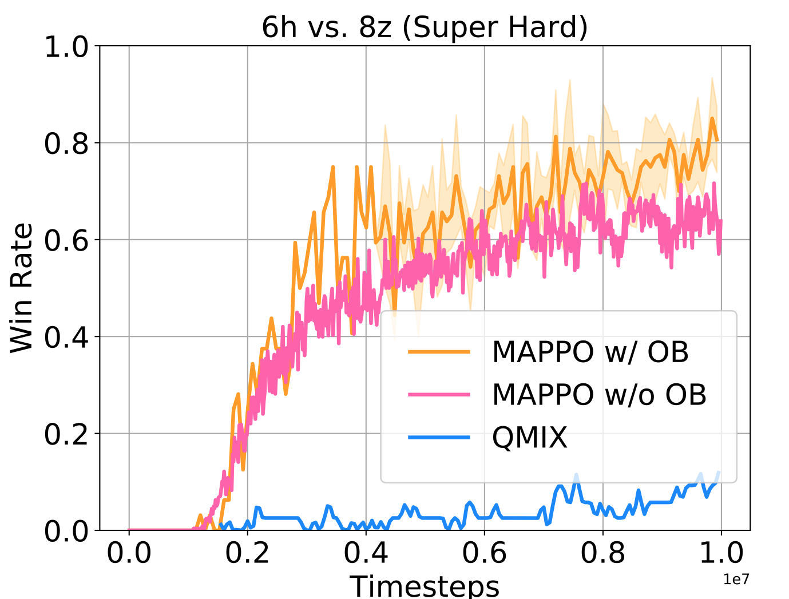

# Settling-the-Variance-of-Multi-Agent-Policy-Gradients
This repository implements the optimal baseline (OB) technique, which effectively stabilises training and improves the performance of multi-agent PPO and COMA algorithms by a significant margin.

## Installation
### Create environment
``` Bash
conda create -n ob python=3.9
conda activate ob
pip install -r requirements.txt
conda install pytorch torchvision torchaudio cudatoolkit=11.1 -c pytorch -c nvidia
cd mappo_ob
pip install -e .
```

### Multi-agent MuJoCo
Following the instructios in https://github.com/openai/mujoco-py and https://github.com/schroederdewitt/multiagent_mujoco to setup a mujoco environment. In the end, remember to set the following environment variables:
``` Bash
LD_LIBRARY_PATH=${HOME}/.mujoco/mujoco200/bin;
LD_PRELOAD=/usr/lib/x86_64-linux-gnu/libGLEW.so
```
### StarCraft II & SMAC
Run the script
``` Bash
bash install_sc2.sh
```
Or you could install them manually to other path you like, just follow here: https://github.com/oxwhirl/smac.
At the end, it's the best to export the environment variable $SC2PATH to your StarCraft root path. For example:
``` Bash
export SC2PATH=`pwd`'/StarCraftII'  # the root path of StarCraft on your machine
```

## How to run
When your environment is ready, you could run shell scripts provided. For example:
``` Bash
./train_mappo_hopper.sh  # run mappo with ob experiments on Multi-agent MuJoCo
./train_coma_smac.sh  # run coma with ob experiments on StarCraft II
```
If you would like to change the configs of experiments, you could modify sh files or look for config files for more details.
* For COMA, they're located in coma_ob/src/config.
* For Multi-agent PPO, they're located in mappo_ob/onpolicy/config_mujoco.py or mappo_ob/onpolicy/config_smac.py

## Some results

### COMA on SMAC


### Multi-agent PPO on SMAC



### Multi-agent PPO on MuJoCo


